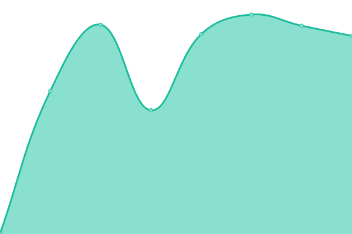

# [📈 Live Status](https://demo.upptime.js.org): <!--live status--> **🟩 All systems operational**

This repository contains the open-source uptime monitor and status page for [Upptime](https://upptime.js.org), powered by [Upptime](https://github.com/upptime/upptime).

With [Upptime](https://upptime.js.org), you can get your own unlimited and free uptime monitor and status page, powered entirely by a GitHub repository. We use [Issues](https://github.com/upptime/upptime/issues) as incident reports, [Actions](https://github.com/tony-nguyen1/upptime/actions) as uptime monitors, and [Pages](https://demo.upptime.js.org) for the status page.

<!--start: status pages-->
<!-- This summary is generated by Upptime (https://github.com/upptime/upptime) -->
<!-- Do not edit this manually, your changes will be overwritten -->
<!-- prettier-ignore -->
| URL | Status | History | Response Time | Uptime |
| --- | ------ | ------- | ------------- | ------ |
|  [Nyx](https://nyx.nguyentony.fr/) | 🟩 Up | [nyx.yml](https://github.com/tony-nguyen1/upptime/commits/HEAD/history/nyx.yml) | 

 762ms
     
 | 

<a href="https://tony-nguyen1.github.io/upptime/history/nyx">100.00%</a>
    

|  [CV en ligne](https://cv.nguyentony.fr/) | 🟩 Up | [cv-en-ligne.yml](https://github.com/tony-nguyen1/upptime/commits/HEAD/history/cv-en-ligne.yml) | 

 827ms
     
 | 

<a href="https://tony-nguyen1.github.io/upptime/history/cv-en-ligne">100.00%</a>
    

|  [Aggrégateur de lien](http://link.nguyentony.fr/) | 🟩 Up | [aggregateur-de-lien.yml](https://github.com/tony-nguyen1/upptime/commits/HEAD/history/aggregateur-de-lien.yml) | 

 477ms
     
 | 

<a href="https://tony-nguyen1.github.io/upptime/history/aggregateur-de-lien">100.00%</a>
    

|  [Forgejo auto-hébergé](https://forgejo.nguyentony.fr/) | 🟩 Up | [forgejo-auto-heberge.yml](https://github.com/tony-nguyen1/upptime/commits/HEAD/history/forgejo-auto-heberge.yml) | 

 771ms
     
 | 

<a href="https://tony-nguyen1.github.io/upptime/history/forgejo-auto-heberge">100.00%</a>
    

<!--end: status pages-->

[**Visit our status website →**](https://demo.upptime.js.org)

## 📄 License

- Powered by: [Upptime](https://github.com/upptime/upptime)
- Code: [MIT](./LICENSE) © [Anand Chowdhary](https://anandchowdhary.com), supported by [Pabio](https://pabio.com)
- Data in the `./history` directory: [Open Database License](https://opendatacommons.org/licenses/odbl/1-0/)
